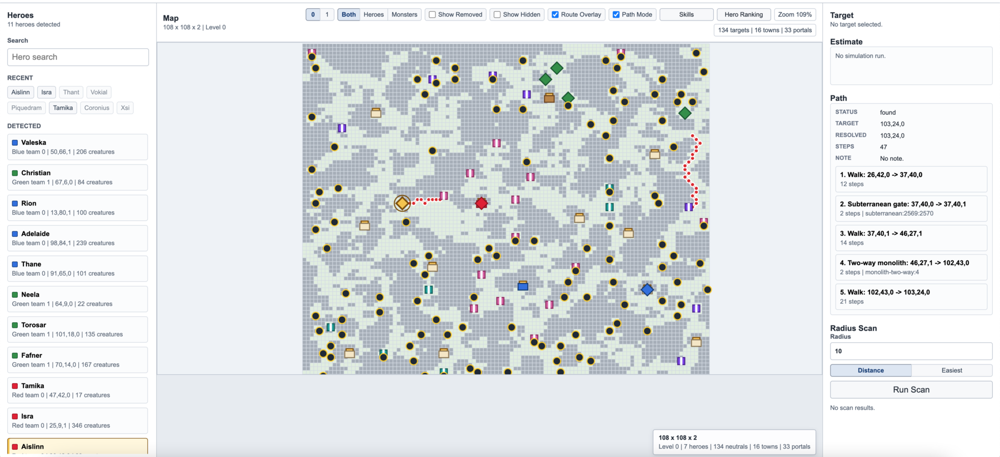
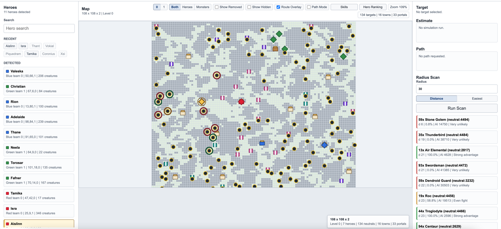

# H3 Companion

H3 Companion is a local helper for Heroes of Might and Magic III Complete. It
reads autosaves and map files from a local installation, renders a simple map
view, and helps estimate which fights are worth taking.

This is an unofficial fan utility. It does not include Heroes III game assets,
maps, saves, or binaries; you need your own legally installed copy of the game.

## Features

- GM1/GM2 autosave discovery and save navigation.
- Hero army extraction from observed single-player, multiplayer, and hotseat
  saves.
- Battle estimation for manual armies, save heroes, nearby neutral stacks, and
  enemy heroes.
- Browser GUI with a simple tile map, optional dual-level view, hero/monster
  markers, target hiding, combat-score hero ranking with map marker numbers,
  an Auto center control with manual Reset view, radius scans, town threat
  alerts, portal hints, and pathfinding overlays.
- H3M map parsing for neutral monsters, towns, portals, subterranean gates, and
  route layers.
- Secondary-skill recommendations for standard heroes.

## Battle Model Transparency

Battle estimates still start from the detected creature stacks in your save. For
verified hero-combat save context, the estimator also applies save-derived
current Attack/Defense and passive Offence, Armorer, and Archery modifiers. This
currently covers narrow GM1 and GM2 combat-context profiles: GM1 saves with
`H3SVG` at offset `0` and raw `0x00` hero records, plus GM2 saves with `H3SVG`
at offset `65` and XOR `0x01` hero records. Other observed GM1/GM2 hero armies
can still be listed and scanned even when their combat modifiers are not
available.

The CLI and GUI label each estimate side as `army-only`, `primary-only`, or
`primary+secondary`, and show which modifiers were applied. The GUI also lists
major omitted model components: artifacts, active spells, morale/luck, and
tactics. Other simplifications remain, including terrain effects, specialty
effects, and many creature special abilities.

## Screenshots

Use the map view to turn an autosave into a tactical overview: detected heroes,
neutral stacks, towns, portals, and route overlays stay visible in one compact
screen.



Radius scans highlight nearby targets directly on the map and rank them in the
side panel, so you can quickly decide whether to clear, avoid, or route around a
fight.



Town markers and threat alerts use save-derived current ownership when it is
available for the loaded snapshot. Set `My color` in the Heroes sidebar, then
use `Alert radius` to list enemy heroes within that same-level map-tile distance
of your owned towns. Alert rows focus the enemy hero marker on the map when it
is visible. Hovering an alert row previews the configured radius around that
enemy hero and highlights every threatened town in that alert. Town details
show current owner before initial map owner. When current town ownership cannot
be inferred from the save, the GUI shows a diagnostic and does not fall back to
initial map owners for alert logic.

## Quick Start

Run the local browser GUI:

```bash
python3 tools/battle_estimator_gui.py
```

By default it serves `http://127.0.0.1:8765`.

Run the CLI wizard:

```bash
python3 tools/battle_estimator.py
```

Optional MCP strategic advisor server for local MCP clients:

```bash
uv run --python 3.13 --with mcp python tools/battle_estimator_mcp.py
```

See [docs/mcp-strategic-advisor-runbook.md](docs/mcp-strategic-advisor-runbook.md)
for setup, tool sequence, limitations, and privacy rules.

Run tests:

```bash
python3 -m unittest
node --check tools/battle_estimator_gui/app.js
```

## Local Paths

The default save root targets the common Porting Kit layout on macOS:

```text
$HOME/Applications/Heroes of Might and Magic 3.app/Contents/SharedSupport/prefix/drive_c/GOG Games/HoMM 3 Complete/Games
```

You can select a different save folder in the GUI. The tool stores local
preferences outside the repository under:

```text
$HOME/.config/vcmi-battle-estimator/config.json
```

The config directory name is retained for compatibility with older local
versions of the tool.

## VCMI Data

The project has no runtime dependency on the VCMI source tree or VCMI binaries.
It uses a small VCMI-derived configuration snapshot for standard hero, hero
class, and secondary-skill metadata:

- `config/heroClasses.json`
- `config/skills.json`
- `config/heroes/*.json`

Some battle-estimator constants and map parsing behavior are also documented
against VCMI as a mechanics reference. See `NOTICE.md` for details.

## Releases And Compatibility

Release notes are tracked in [CHANGELOG.md](CHANGELOG.md).

Versioning, public compatibility expectations, and the release checklist are
documented in [docs/release-policy.md](docs/release-policy.md).

## License

H3 Companion is licensed under the GNU General Public License version 2 or
later. See `LICENSE`.

VCMI source code is licensed under GPL version 2 or later. The vendored VCMI
license text is kept at `third_party/vcmi/license.txt`. The upstream VCMI
project is at <https://github.com/vcmi/vcmi>.
